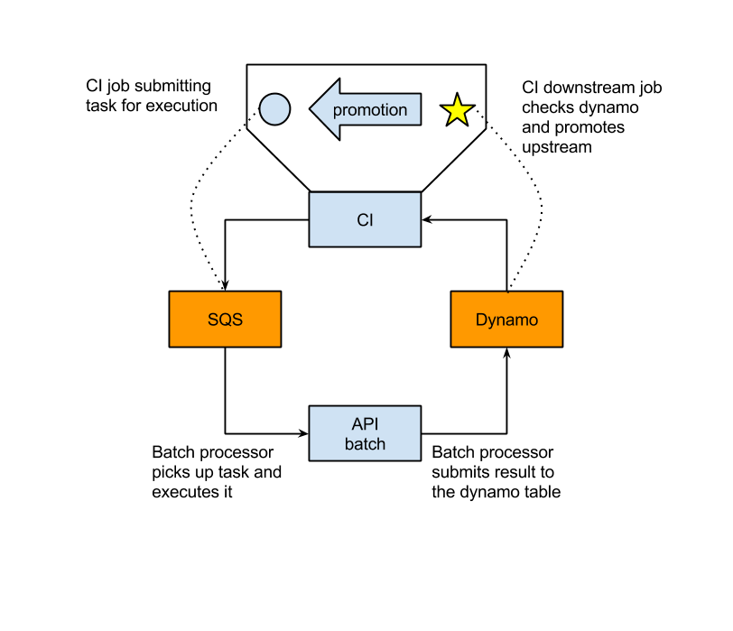

# aws-api-batch-processor
This is a tool designed to separate jenkins from wide-open AWS credentials, while still allowing to run quite aggressive calls against AWS API. 

Simple stupid approach. Shell script runs on totally closed ec2 instance, litens SQS, executes API calls and publish result in Dynamo.



## Example jenkins task - submitter
This task will submit api call to sqs. Use Promote Build plugin to trigger "Promoter" task as a last step.
```bash
OPTS="--stack-name $STACK_NAME \
      --template-url https://s3-ap-southeast-2.amazonaws.com/<bucketname>/<foldername>/${BUILD_TAG}.json \
      --parameters ParameterKey=AMI,ParameterValue=$AMI \
                  ParameterKey=ASGSubnets,ParameterValue=$SUBNET \
                  ParameterKey=VpcId,ParameterValue=$VPC_ID \
                  ParameterKey=KeyName,ParameterValue=$KEY_NAME \
                  ParameterKey=AZs,ParameterValue=$AZ \
      --capabilities CAPABILITY_IAM"
     
     
     
MESSAGE="{\"JenkinsJob\"   :\"$JOB_NAME\", \
          \"JenkinsBuild\" :\"$BUILD_NUMBER\", \
          \"RunCommand\"   :\"aws\", \
          \"RunSubCommand\":\"cloudformation\", \
          \"RunAction\"    :\"create-stack\", \
          \"RunOptions\"   :\"$OPTS\", \
          \"PreRunCommand\":\"\", \
          \"PreRunOptions\":\"\" \
          }"

PACK_MESSAGE=$( echo $MESSAGE | base64 -w0 )

QUEUE="https://ap-southeast-2.queue.amazonaws.com/<account-id>/<queue-name>"
COMMAND="sqs send-message --queue-url $QUEUE --message-body $PACK_MESSAGE"
```

## Example jenkins task - promoter
This task must be triggered as a last step from "Submitter". It will poll dynamodb for status of last call and if successfull  - will promote "Submitter"
```bash
runtest () {
    RET=$(aws dynamodb get-item \
             --table-name <dynamo-table> \
             --key {\"Name\"\:{\"S\"\:\"ci-$UP_JOB_NAME\"}} \
             --output json \
             --region ap-southeast-2)

    RET_BUILD=$(echo $RET | jq -r .Item.JenkinsBuild.N)
    RET_RESULT=$(echo $RET | jq -r .Item.Result.S)
    if [[ $RET_BUILD == $UP_BUILD_NUMBER ]] && [[ $RET_RESULT == "success" ]]; then
        return 0
    else
        return 1
    fi
}

env

for i in `seq 1 2`; do
    runtest && exit 0
    sleep 60
done

exit 1
```
